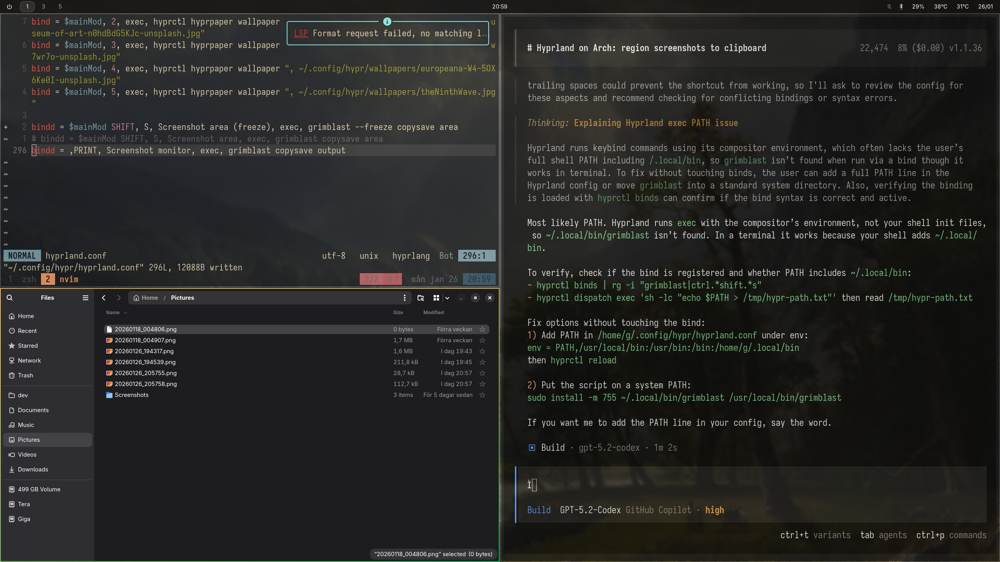

+++
title = "Hello World"
description = "Lorem ipsum dolor sit amet"
date = 2026-01-28
draft = true
+++

This is a sample post in the new Zola blog.

# 1 Heading

wow

## 2 Heading

wow

### 3 Heading

wow

#### 4 Heading

wow

##### 5 Heading

wow

## Code Example

```typescript
console.log('Hello from Shiki!');
const sum = (a: number, b: number) => a + b;
```

## Typography Test

Here is some *italic serif text* using Newsreader, and some **bold sans text**.

And then he said *hello* very strangely, almost as if he had an *agenda*.



> This is a blockquote to test the styling of quotes in markdown.
